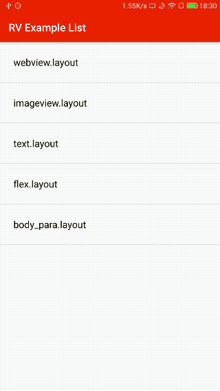

HtmlNative
========

HtmlNative，用Html+css渲染Android原生控件；如果你还需要一些逻辑，支持Lua。

这个工具的诞生，来源于一个简单的想法：

虽然RN和Weex，已经提供了强大的能力，用Js来实现原生的开发；

但强大的背后，是要面对的是较为陡峭学习曲线，从JavaScript到React\Vue, 这个曲线或许并不是对每个人都那么友好。

但Html，应该是所有人都能学会的语言，试试用这个来实现;

有想法就去实践好了，于是乎有了HtmlNative这个四不像的“怪物”。

## 例子:

一个简单的Html；如果需要一些简单的逻辑，也可以加一些Lua的调味料做辅助。

```html
<html>
<head>
    <style>
        #text1{
            color: #000;
            font-size: 16;
            padding: 10
        }
    </style>
</head>
<body>
    <p id="text1">
        This is an example of ImageView
        <br />2 Images are shown.
    </p>
    
    

    <button onClick="changeText1">clickme</button>
</body>
<script type="text/lua">
    -- Toast in Android
    alert("hello world")

    -- 定义一个全局变量，并将其初始值置为false
    b = false

    -- 定义一个函数，实现一些简单的逻辑
    function changeText1()
        -- 通过id找到view
        local v = view("text1")

        -- 设置下样式
        if(b) then
            v.style("background:red;color:#fff")
        else
            v.style("background:blue;color:red")
        end

        b = not(b)

    end

    -- 将这个函数注册，使得Android能调用到
    callback("changeText1", changeText1)

    -- Done.

</script>
</html>
```

通过HtmlNative渲染后的结果:



## In Android

像这样来使用 :

```java

// 通过任何方式，拿到html
String htmlStr = ...

HNative.getInstance().loadView(context, mActivity.getAssets().open(fileName), new HNative.OnHNViewLoaded() {

    @Override
    public void onViewLoaded(View v) {
        // do what ever you want to deal with this view
    }

    @Override
    public void onError(Exception e) {
        // if anything went wrong, for example, there is syntax error in html.
    }

    @Override
    public void onHead(HNHead head) {
        // here you can receive the <head> element, deal with title, meta...
    }
});

```

### License

Copyright 2016 Hsllany. All rights reserved.

    Licensed under the Apache License, Version 2.0 (the "License");
    you may not use this file except in compliance with the License.
    You may obtain a copy of the License at

        http://www.apache.org/licenses/LICENSE-2.0

    Unless required by applicable law or agreed to in writing, software
    distributed under the License is distributed on an "AS IS" BASIS,
    WITHOUT WARRANTIES OR CONDITIONS OF ANY KIND, either express or implied.
    See the License for the specific language governing permissions and
    limitations under the License.

