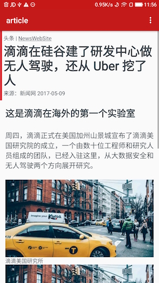
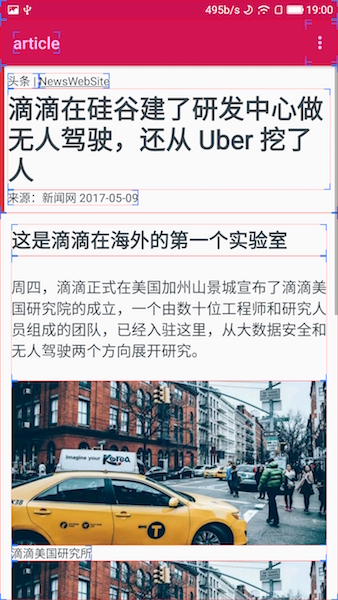

HtmlNative
========

[English](README_English.md)

使用Html来渲染Android界面的动态化界面方案。

不同于Webview, HtmlNative直接将Html和Css转换成原生控件，这样做的好处是：

- 满足部分定制化的场景需求，客户端无需发版，通过服务器渲染HTML+CSS，客户端展现即可
- 不同于WebView，原生控件让界面可以能达到更好的体验效果，且用户无感知
- 客户端可以自定义HTML标签和对应控件，灵活开发
- 简易部署，使用最容易的html + css来控制界面
- 此外，还可以通过内嵌在html```<script>```标签中的[ Lua ](http://www.lua.org/)脚本，来控制整个动态化控件的部分行为。其中集成了部分API，构成HNLua API.

> 远景目标是把JavaScript通过V8引擎集成，这样就完成了对整个H5技术栈的模拟

## Html支持情况

```html
<a>, <p>, <h1>, <h2>, <h3>, <h4>, <h5>, <h6>, <input>, , <div>, <br>, <iframe>

属性：style, onclick（需要再lua脚本中定义onclick事件，后续完善相关文档), id, class, href(for <a>), src(for )
```

## css支持情况

支持内联style属性，及```<head>```中```<style>```标签的内嵌css。不支持链接形式的css样式文件。

### 支持的css样式

width, height, background, background-color, background-position, background-size, padding, padding-left, padding-right, padding-top, padding-bottom, margin, margin-top, margin-left, margin-right, margin-bottom, visibility

font-size, color, line-height, font-style, font-weight, text-align, word-spacing, text-overflow, text-transform

### 支持的选择器

type选择器

```css
p{}
div{}

id选择器
#id1{}

class选择器
.class1{}

组
#id1, #id2{}

子孙选择器
div p{}

子选择器
div > p{}

全部选择器
*{}
p *{}
```


## 例子

通过HtmlNative渲染后的结果:

[Download Video](doc/screen1.mp4)




Html:

```html
<html>
<head>
    <meta http-equiv="Content-type" content="text/html; charset=utf-8"/>
    <meta name="viewport"
          content="user-scalable=no, initial-scale=1, maximum-scale=1, minimum-scale=1"/>
    <style>
	html{
		font-size: 62.5%;

	}

	body{
		margin: 0;
		padding: 0;
		color: #3f484f;
	}

	.header{
	    color:#3f484f;
		padding: 2em;
		background: #db3541;
		-hn-background-color-size: 1.2em 100%;

	}

	.article{
	    padding: 3em
	 }

	 p{
	    padding: 5em 0;
	    font-size: 4em;
	    line-height: 120%
	  }
    </style>
    <title>article</title>
</head>
<body>
<div class="header">
    <span id="leheadline_head_icon">头条 | </span>
    <a href="http://www.sina.com.cn/">NewsWebSite</a>
    <h1>滴滴在硅谷建了研发中心做无人驾驶，还从 Uber 挖了人</h1>
    <span id="leheadline_source">来源：新闻网 2017-05-09</span>
</div>

<div class="article">
    <h2>这是滴滴在海外的第一个实验室</h2>
    <p>周四，滴滴正式在美国加州山景城宣布了滴滴美国研究院的成立，一个由数十位工程师和研究人员组成的团队，已经入驻这里，从大数据安全和无人驾驶两个方向展开研究。</p>

    <div class="leheadline_img_wrapper">
        
        <span class="leheadline_intro">滴滴美国研究所</span>
    </div>

    

    <p>美国研究院由滴滴研究院副院长弓峰敏带领。弓峰敏是去年 9 月加入滴滴，担任滴滴信息安全战略副总裁和滴滴研究院副院长，并开始组建美国研究院。加盟滴滴之前，他是安全公司 Palo Alto
        Networks 的联合创始人。</p>
        
    <p>这一次，滴滴还从Uber挖来了查理·米勒（Charlie Miller）。米勒被誉为全球顶级安全专家，曾是一名黑客，从事苹果越狱和安全研究，在加入 Uber
        之前，米勒受雇于苹果。2015 年，米勒完成了对一辆吉普切诺基的远程控制实验。2015 年 9 月，他加入Uber担任汽车安全工程师。</p>

    <p>在Twitter上，米勒表示他的工作是帮助滴滴研发和使用的自动驾驶系统抵抗来自外部的攻击和威胁。在宣布加入滴滴美国研究院的消息之后，他又发布推文表示实验室正在招人。</p>
</div>

<div id="leheadline_other">
    
</div>
</body>
</html>
```

## 使用方法：

```java

InputStream htmlSource = ...;

// 在需要加载view的时候加载
HNativeEngine.getInstance().loadView(mActivity, htmlSource, new
                    HNativeEngine.OnHNViewLoaded() {

    @Override
    public void onViewLoaded(View v) {
        if (mActivity != null && !mActivity.isDestroyed()) {
            mActivity.setContentView(v);
        }
    }

    @Override
    public void onError(Exception e) {

    }

    @Override
    public void onHead(HNHead head) {
        
    }
});

```

## HNLua API

HNLua API是一套定义在HtmlNative框架下的精简API，通过该API，可以灵活的控制界面、调整样式、跳转url、以及有限地访问部分Android的基础能力。

### 例子：

```html
<html>
    <head>
        <title>iframe</title>
        <meta name="nihao" content="world"/>
        <style>
            #text1{
                background:red;
                color:green;
                margin: 3em 3em;
                padding: 2em;
            }

            button{
                color:yellow
            }

            #parent{
                color: red;
             }

        </style>
    </head>

    <body>
        <text id="text1">This is an demo of iframe<br/>nihao
        </text>
        <button onclick="changeText1">click me</button>
    <div id="parent" class="claz1 claz2 claz3"></div>
    </body>

    <script type="text/lua">
        toast("hello world")

        b = false

        local vv = document.createView("p", "")
        vv.setAttribute("text:helloworld");

        local parent = getElementById("parent")

        parent.appendChild(vv)

        console.log(vv.toString())
        console.log(vv.getAttribute("background"));

        function changeText1()
            local v = getElementById("text1")
            console.log(v.id())
            if(b) then
                v.setAttribute("background:red;color:#fff")
            else
                v.setAttribute("background:blue;color:red")
            end
            b = not(b)

            document.jump("http://www.baidu.com")

        end
    </script>
</html>
```

以上示例，使用HNLuaAPI, 动态添加了一个生成了一个```<p>```，并设置了其```text```属性，最终添加到```id=parent```的```<div>```中；

此外，在html中有一段```<button onclick="changeText1">click me</button>```，为```<button>```控件设置了一个点击事件，事件的行为，在下面由函数```changeText1()```定义：通过变量b的值，动态改变其背景色和文字颜色；并跳转链接。

更多的HNLua API文档及例子可见：待补充。


## License

Copyright 2016 Hsllany. All rights reserved.

    Licensed under the Apache License, Version 2.0 (the "License");
    you may not use this file except in compliance with the License.
    You may obtain a copy of the License at

        http://www.apache.org/licenses/LICENSE-2.0

    Unless required by applicable law or agreed to in writing, software
    distributed under the License is distributed on an "AS IS" BASIS,
    WITHOUT WARRANTIES OR CONDITIONS OF ANY KIND, either express or implied.
    See the License for the specific language governing permissions and
    limitations under the License.

