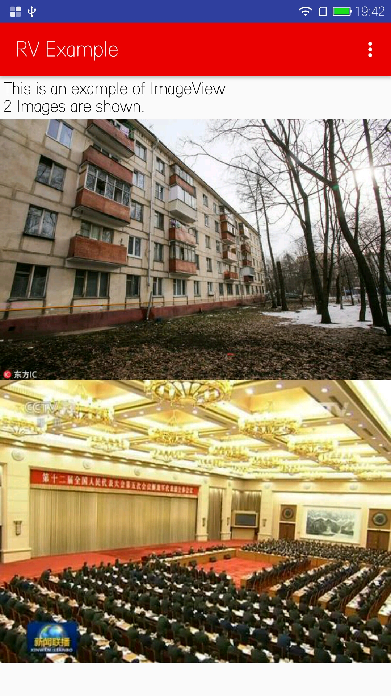

HtmlNative
========

HtmlNative is a library that parse html (subset) to native widget.

Example:

```html
<html>
<body>
    <p style="color: #000; font-size: 16; padding: 10">
        This is an example of ImageView
        <br />2 Images are shown.
    </p>
    
    
</body>
</html>
```

Through HtmlNative, an view like this will be displayed. (All its widget is native widget):



### Usage

All you have to do is :

```java
String htmlStr = ...;

HNative.getInstance().loadView(mContext, htmlStr, new HNative.OnRViewLoaded() {
    @Override
    public void onViewLoaded(View v) {
        // do some view load work here
    }

    @Override
    public void onError(Exception e) {

    }
});

```

### Supported Tag and features:

| Tag        | Native Widget           | Html Properties  |
| ------------- |:-------------:|-----|
| p      | TextView | inner element, color, background |
| img      | ImageView      |   src |
| iframe | WebView      |    src |
| input | EditText      |  |
| div | LinearLayout, FlexBoxLayout | background |
| a | TextView with click event      | href, same as p |
| br | \n in textview      |  |

### Roadmap

1. Currently HtmlNative dose not support css link, will or will not support in future, under consideration.
2. Working on Lua script, may support js via using V8 engine.

### License

Copyright 2016 Aspsine. All rights reserved.

    Licensed under the Apache License, Version 2.0 (the "License");
    you may not use this file except in compliance with the License.
    You may obtain a copy of the License at

        http://www.apache.org/licenses/LICENSE-2.0

    Unless required by applicable law or agreed to in writing, software
    distributed under the License is distributed on an "AS IS" BASIS,
    WITHOUT WARRANTIES OR CONDITIONS OF ANY KIND, either express or implied.
    See the License for the specific language governing permissions and
    limitations under the License.

