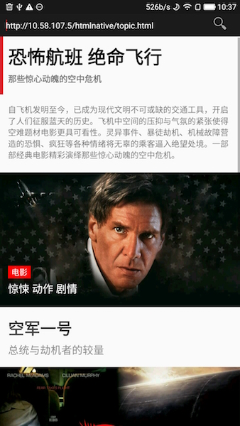

HtmlNative
========

Using Html to render Android native views.

Other than Webview, HtmlNative directly parses HTML and CSS into Android native views, which will：

- Reach better user-expirence by native widgets
- Make UI dynamic, no need to release new version of application
- Easy to write html and css
- Define your own html tag
- Support inline script of Lua, by which you can control the logic inside of this view.

> Future plan is trying to embed javascript in it. 

## Html Support

```html
<a>, <p>, <h1>, <h2>, <h3>, <h4>, <h5>, <h6>, <input>, , <div>, <br>, <iframe>

parameters：style, onclick（need Lua script, later will finish related function), id, class, href(for <a>), src(for )
```

## CSS Support

inline style，and ```<style?``` tag inside ```<head>```. Do Not Support standalone css files。

### CSS styles

width, height, background, background-color, background-position, background-size, padding, padding-left, padding-right, padding-top, padding-bottom, margin, margin-top, margin-left, margin-right, margin-bottom, visibility

font-size, color, line-height, font-style, font-weight, text-align, word-spacing, text-overflow, text-transform

Also, you can fetch native resources (color, drawable) via '@' node:

```
background: url(@pic);
color: @colorPrimary;
```

### CSS Selectors

type selectors

```css
p{}
div{}
```

id selectors

```css
#id1{}
```

class selectors

```css
.class1{}
```

group

```
#id1, #id2{}
```

descendant selectors

```css
div p{}
```

child selectors

```css
div > p{}
```

universal selectors

```css
*{}
p *{}
```


## Example

After rendering:

[Download Video](doc/screen1.mp4)




Html:

```html
<html>
<head>
    <meta http-equiv="Content-type" content="text/html; charset=utf-8"/>
    <meta name="viewport"
          content="user-scalable=no, initial-scale=1, maximum-scale=1, minimum-scale=1"/>
    <style>
	html{
		font-size: 62.5%;

	}

	body{
		margin: 0;
		padding: 0;
		color: #3f484f;
	}

	.header{
	    color:#3f484f;
		padding: 2em;
		background: #db3541;
		-hn-background-color-size: 1.2em 100%;

	}

	.article{
	    padding: 3em
	 }

	 p{
	    padding: 5em 0;
	    font-size: 4em;
	    line-height: 120%
	  }
    </style>
    <title>article</title>
</head>
<body>
<div class="header">
    <span id="leheadline_head_icon">头条 | </span>
    <a href="http://www.sina.com.cn/">NewsWebSite</a>
    <h1>滴滴在硅谷建了研发中心做无人驾驶，还从 Uber 挖了人</h1>
    <span id="leheadline_source">来源：新闻网 2017-05-09</span>
</div>

<div class="article">
    <h2>这是滴滴在海外的第一个实验室</h2>
    <p>周四，滴滴正式在美国加州山景城宣布了滴滴美国研究院的成立，一个由数十位工程师和研究人员组成的团队，已经入驻这里，从大数据安全和无人驾驶两个方向展开研究。</p>

    <div class="leheadline_img_wrapper">
        
        <span class="leheadline_intro">滴滴美国研究所</span>
    </div>

    

    <p>美国研究院由滴滴研究院副院长弓峰敏带领。弓峰敏是去年 9 月加入滴滴，担任滴滴信息安全战略副总裁和滴滴研究院副院长，并开始组建美国研究院。加盟滴滴之前，他是安全公司 Palo Alto
        Networks 的联合创始人。</p>

    <div class="leheadline_video_wrapper">
        <video src="http://www.w3school.com.cn/example/html5/mov_bbb.mp4" type="video/mp4"
               controls="controls" poster="coop/pic.png" preload="none"></video>
    </div>

    <div class="leheadline_video_wrapper">
        <video src="http://www.w3school.com.cn/example/html5/mov_bbb.mp4" type="video/mp4"
               controls="controls" poster="coop/pic.png" preload="none"></video>
        <span class="leheadline_intro">说明</span>
    </div>

    <p>这一次，滴滴还从Uber挖来了查理·米勒（Charlie Miller）。米勒被誉为全球顶级安全专家，曾是一名黑客，从事苹果越狱和安全研究，在加入 Uber
        之前，米勒受雇于苹果。2015 年，米勒完成了对一辆吉普切诺基的远程控制实验。2015 年 9 月，他加入Uber担任汽车安全工程师。</p>

    <p>在Twitter上，米勒表示他的工作是帮助滴滴研发和使用的自动驾驶系统抵抗来自外部的攻击和威胁。在宣布加入滴滴美国研究院的消息之后，他又发布推文表示实验室正在招人。</p>
</div>

<div id="leheadline_other">
    
</div>
<script src="http://rec.letv.com/detail_template/script-v1.js"> </script>
</body>
</html>
```

## Usage：

```java

InputStream htmlSource = ...;

// Load the inputstream of html
HNativeEngine.getInstance().loadView(mActivity, htmlSource, new
                    HNativeEngine.OnHNViewLoaded() {

    @Override
    public void onViewLoaded(View v) {
        if (mActivity != null && !mActivity.isDestroyed()) {
            mActivity.setContentView(v);
        }
    }

    @Override
    public void onError(Exception e) {

    }

    @Override
    public void onHead(HNHead head) {
        
    }
});

```

## HNLuaAPI

HNLuaAPI is a set of pre-defined apis that gives you the ability to call some Android Native Services. You can write them inside ```<script type="text/lua">```. Here is a simple examle:

```html
<html>
    <head>
        <title>iframe</title>
        <meta name="nihao" content="world"/>
        <style>
            #text1{
                background:red;
                color:green;
                margin: 3em 3em;
                padding: 2em;
            }

            button{
                color:yellow
            }

            #parent{
                color: red;
             }

        </style>
    </head>

    <body>
        <text id="text1">This is an demo of iframe<br/>nihao
        </text>
        <button onclick="changeText1">click me</button>
    <div id="parent" class="claz1 claz2 claz3"></div>
    </body>

    <script type="text/lua">
        toast("hello world")

        b = false

        local vv = document.createView("p", "")
        vv.setAttribute("text:helloworld");

        local parent = getElementById("parent")

        parent.appendChild(vv)

        console.log(vv.toString())
        console.log(vv.getAttribute("background"));

        function changeText1()
            local v = getElementById("text1")
            console.log(v.id())
            if(b) then
                v.setAttribute("background:red;color:#fff")
            else
                v.setAttribute("background:blue;color:red")
            end
            b = not(b)

            document.jump("http://www.baidu.com")

        end
    </script>
</html>
```

Detail document of this API will be added in the near future, Still working on it. Below is a snapshot:

```lua
--Print log in Android Logcat with tag "HNConsole"
console.log(msg)
console.error(msg)
console.info(msg)
console.warn(msg)

--Global operations
document.version()	--Get current HNLuaAPI version
document.jump(url) 	--Jump to an url or uri.
doucment.createView(tag, style) --Create a html element with tagname 'tag' and inline style 'style'

--Finding the HtmlElement
local lview = getElementById(id) --Get html element by id

--LView object, result of "getElementById"
lview.toString()	--Get the string description of this view
lview.setAttribute(style)	--Set its style. Example: lview.setAttribute("color:red")
lview.id()	--Get id
lview.className()	--Get class array(LuaTable)
lview.appendChild(lviewChild)	--Insert an view
lview.insertBefore(lviewChild)	--Insert an view at the very first beginning
lview.removeChild(lviewChild)	--Remove the view
lview.childNodes()	--Get all children views
lview.getAttribute(stylename)	--Get css attribute according to a style name
lview.tagName()	--Get html tagname of this view
lview.hasChildNode() --Check if this view has children

--toast
toast("helloworld")	--Display a toast in Android
```


## License

Copyright 2016 Hsllany. All rights reserved.

    Licensed under the Apache License, Version 2.0 (the "License");
    you may not use this file except in compliance with the License.
    You may obtain a copy of the License at

        http://www.apache.org/licenses/LICENSE-2.0

    Unless required by applicable law or agreed to in writing, software
    distributed under the License is distributed on an "AS IS" BASIS,
    WITHOUT WARRANTIES OR CONDITIONS OF ANY KIND, either express or implied.
    See the License for the specific language governing permissions and
    limitations under the License.

